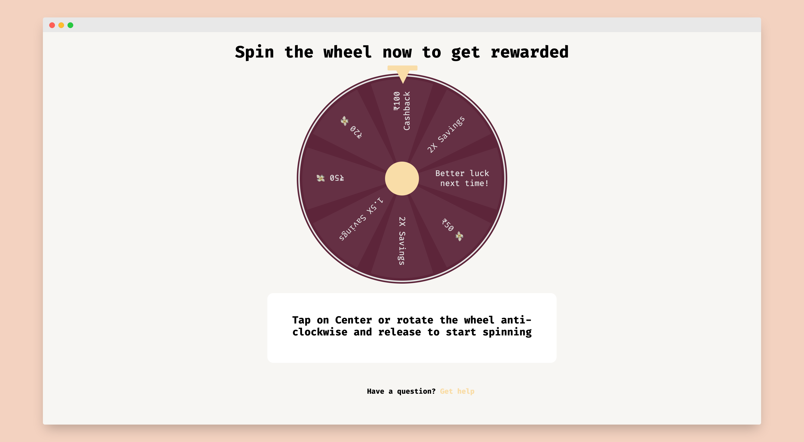

<h1 align="center"> Spin Wheel 🎡 </h1>

[Spin Wheel](), a web app that allows the user to spin by tapping on center, and get the reward mentioned on the segment of wheel where it stops. Also storing the informations in a google sheet, using [google sheets API](https://developers.google.com/sheets/api)

**Just Spin and Win Prizes** 😉

<hr>

<div align="center">

 </img>

</div>

## Table of Contents

- [Technology Stack](#technology-stack)
- [Installation & Usage](#installation-&-usage)
- [Testing](#testing)

## Technology Stack

| Technology          | Description                               | Link ↘️                                     |
| --------------------| ----------------------------------------- | ------------------------------------------ |
| HTML5               | Hyper Text Markup Language                | ----                                       |
| CSS3                | Cascading Style Sheets                    | ----                                       |
| JavaScript          | High Level, Dynamic, Interpreted Language | ----                                       |
| React               | Front End JavaScript Framework            | https://reactjs.org/                       |
| Google Sheets API   | Read, write, and format data in Sheets    | https://developers.google.com/sheets/api   |
| PWA                 | Progressive Web Apps                      | https://web.dev/progressive-web-apps/      |
| Vercel              | Deployment                                | https://vercel.com/                        |


## Installation & Usage

_Ensure [Node.js](https://nodejs.org/en/) and [NPM](https://www.npmjs.com/) are installed_

1. Clone or Download the repository (Depending on whether you are using SSH or HTTPS)

```
git clone git@github.com:abhisheknaiidu/a-pop.git
cd a-pop
```

2. Install dependencies

```
npm i
```

3. Start the application

```
npm start
```

After the application starts visit [http://localhost:3000](http://localhost:3000) to view it in the browser.

## Testing

Run the command `npm test` to run the tests

`npm run build`
